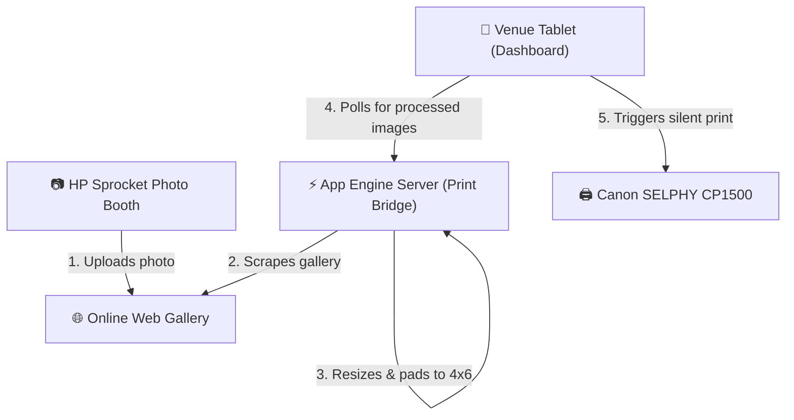

# Photo Booth Printing Bridge 📷🖨️

A node-based bridge application designed to automate low-cost event printing from an **HP Sprocket Photo Booth** (or any online photo pool) to a local **Canon SELPHY CP1500** printer using a tablet dashboard.

---

## ⚡ How It Works



1. **Scraping**: The backend automatically scrapes and polls the HP online gallery at a regular interval (using `cheerio` or custom Firestore JSON REST endpoints).
2. **Processing**: When a new image is found, the server downloads it and uses `sharp` to scale/center it onto an 1800x1200 canvas (3:2 print ratio for 4x6" prints) with custom colored margins.
3. **Queueing & Printing**: The venue tablet polls the server. When it detects a new processed image, it adds it to the wall and pushes it into the silent print queue, triggering an auto-print directly to the local Canon SELPHY printer.

---

## 📁 Repository Structure

*   [`server.js`](file:///c:/AntiGravity/photoboth%20device/server.js) — The Express backend, configuration manager, scraper daemon, and image-processing pipeline using Sharp.
*   [`public/`](file:///c:/AntiGravity/photoboth%20device/public/) — Dashboard frontend assets:
    *   [`index.html`](file:///c:/AntiGravity/photoboth%20device/public/index.html) — Main Event Kiosk Dashboard UI.
    *   [`app.js`](file:///c:/AntiGravity/photoboth%20device/public/app.js) — Polling, queue management, setting updates, and printing orchestration.
    *   [`styles.css`](file:///c:/AntiGravity/photoboth%20device/public/styles.css) — Dashboard layout and dark theme.
    *   [`print.html`](file:///c:/AntiGravity/photoboth%20device/public/print.html) — Stripped-down page printed via an `iframe` overlay.
*   [`system_setup_guide.md`](file:///c:/AntiGravity/photoboth%20device/system_setup_guide.md) — Detailed event configuration instructions for printer, tablet (Fully Kiosk Browser), and server.
*   [`config.json`](file:///c:/AntiGravity/photoboth%20device/config.json) — Writeable runtime configuration parameters (overrides environment variables).
*   [`db.json`](file:///c:/AntiGravity/photoboth%20device/db.json) — Local JSON database tracking original URLs and processed outputs.

---

## 🛠️ Installation & Setup

### Prerequisites
*   Node.js (v18+)

### Step-by-Step Run
1.  Clone the repository to your host device.
2.  Install dependencies:
    ```bash
    npm install
    ```
3.  Configure the environment in a `.env` file (copied from variables in `server.js` or configured via the settings modal):
    *   `PORT=3000`
    *   `TARGET_GALLERY_URL=https://example.com/gallery`
    *   `GALLERY_IMAGE_SELECTOR=img`
    *   `MOCK_MODE=true` (highly recommended for local development/testing)
4.  Start the application:
    ```bash
    npm start
    ```
5.  Open the dashboard: `http://localhost:3000`
6.  Open the Mock Gallery (if `MOCK_MODE=true`): `http://localhost:3000/mock-gallery`

---

## ⚙️ Configuration & Features

*   **Mock Mode**: Simulates photo uploads locally via `http://localhost:3000/mock-gallery` to test printer polling and page behavior without needing internet access or the physical HP Sprocket active.
*   **Dynamic Setting Updates**: Directly update settings (scraped target URL, selector query, fetch rate, cooling delay, canvas padding color) from the dashboard frontend without rebooting the server.
*   **State Resets**: The dashboard features a reset command to clear the local server databases and delete processed image caches to prep for new events.

For detailed hardware setup (including Canon SELPHY CP1500 settings and Android Fully Kiosk Browser configuration), refer to the [System Setup Guide](file:///c:/AntiGravity/photoboth%20device/system_setup_guide.md).
