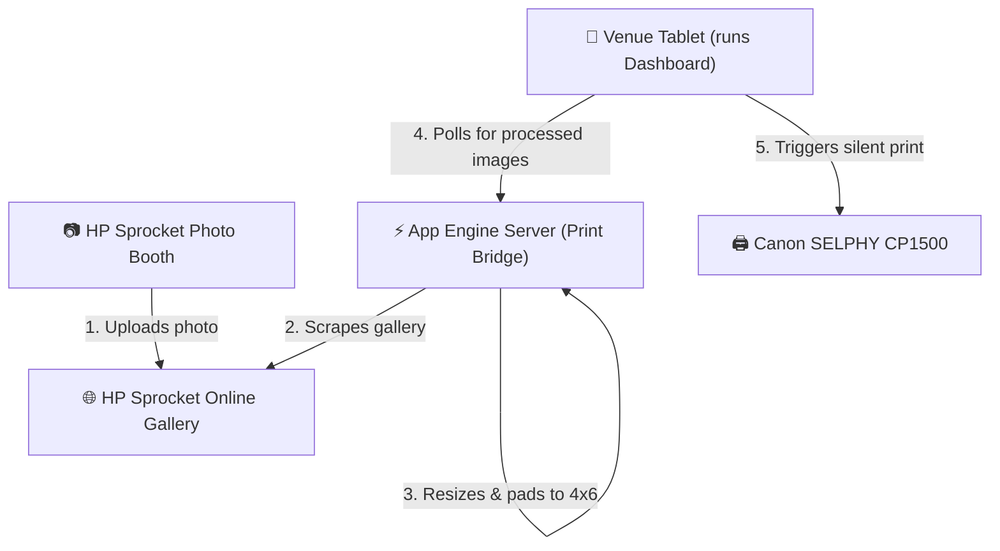

# System Setup & Connection Guide

This guide explains how to connect and configure the complete print pipeline for your event: from the **HP Sprocket Photo Booth** to the **Canon SELPHY CP1500 printer** using your deployed **Print Bridge**.

---

## 1. System Architecture

The following diagram illustrates how data flows through the system:

---

## 2. Step-by-Step Setup

### Step 1: Set up the Canon SELPHY CP1500 Printer
1. Turn on the printer and ensure it is loaded with paper (4x6" size) and ink ribbon.
2. Connect the printer to the **venue's local Wi-Fi network**.
   * *Tip: If venue Wi-Fi is unreliable, use the printer's built-in Direct Wi-Fi Connection mode to connect your tablet directly to the printer's network.*
3. Run a test print from any device to confirm the connection works.

---

### Step 2: Set up the Venue Tablet (Silent Printing)
For a seamless, hands-free event experience, the tablet needs to print photos automatically without showing a pop-up confirmation dialog every time.

#### Recommended: Android Tablet + Fully Kiosk Browser
1. Install **Fully Kiosk Browser** (highly recommended for events).
2. Set up the Canon SELPHY CP1500 as the **default printer** in your Android system settings.
3. Open Fully Kiosk Browser settings:
   * Go to **Web Auto-Play & Printing** -> **Silent Printing**.
   * Toggle **Enable Silent Printing** to `ON`.
4. Open your live URL in Fully Kiosk Browser:
   `https://photo-booth-print-bridge.uc.r.appspot.com`

#### Alternative: iPad / PC (Manual or standard printing)
1. Open Safari/Chrome and navigate to your URL.
2. When a new photo arrives, the browser will open the print preview sheet. A staff member will need to tap "Print". (iOS restricts silent printing in standard Safari for security).

---

### Step 3: Configure the Print Bridge Website
1. Open the dashboard on your tablet: [https://photo-booth-print-bridge.uc.r.appspot.com](https://photo-booth-print-bridge.uc.r.appspot.com)
2. Tap **⚙️ Settings** in the top header.
3. Configure the following fields:
   * **HP Gallery URL**: Enter the web address where your HP Sprocket uploads go (e.g. `https://hp-sprocket-gallery.com/your-event-id`).
   * **CSS Selector for Scraped Photos**: The search pattern to find image tags on the gallery website. *(Defaults to standard tags, but can be updated if the HP gallery uses specific CSS classes).*
   * **Auto-Print New Images**: Set to **Enabled (Background Print)**.
   * **Tablet Fetch Rate**: Set to `3` seconds.
   * **Cooling Delay**: Set to `4` seconds (provides buffer time for the Canon SELPHY paper mechanism to load).
   * **Canvas Border/Background Color**: Select the color (e.g., `#ffffff` for clean white margins) used to pad portrait or non-3:2 aspect ratio photos.
4. Tap **Save Changes**.

---

## 3. How to Run & Verify

1. **Take a Test Picture** with the HP Sprocket Photo Booth.
2. Verify that it uploads to the HP online gallery.
3. Watch the **Kiosk Dashboard** on your tablet:
   * The statistic **Total Photos** should increment.
   * The photo should appear on the **Guest Photo Wall**.
   * The photo should enter the **Print Queue**, show `Printing...`, and exit the queue after the cooling delay.
4. The Canon SELPHY CP1500 will automatically spin up and print the photo!

---

## 4. Troubleshooting at the Event

* **Photos aren't appearing on the Wall**:
  * Tap **⚙️ Settings** and double-check that the **HP Gallery URL** matches the photo upload link exactly.
  * Check the **Server Active / Conn Error** badge in the header. If it shows red, check the tablet's internet connection.
* **Photos appear on the Wall but aren't printing**:
  * Ensure the printer is turned on, has paper/ink, and is connected to the same Wi-Fi network as the tablet.
  * Check if print jobs are stuck in the tablet system's print queue.
* **Resetting the event state**:
  * If you want to clear the dashboard wall and statistics between sessions or events, tap **🗑️ Reset Event** (red button in header) and confirm. This clears the server's cache so it doesn't reprint old history.
